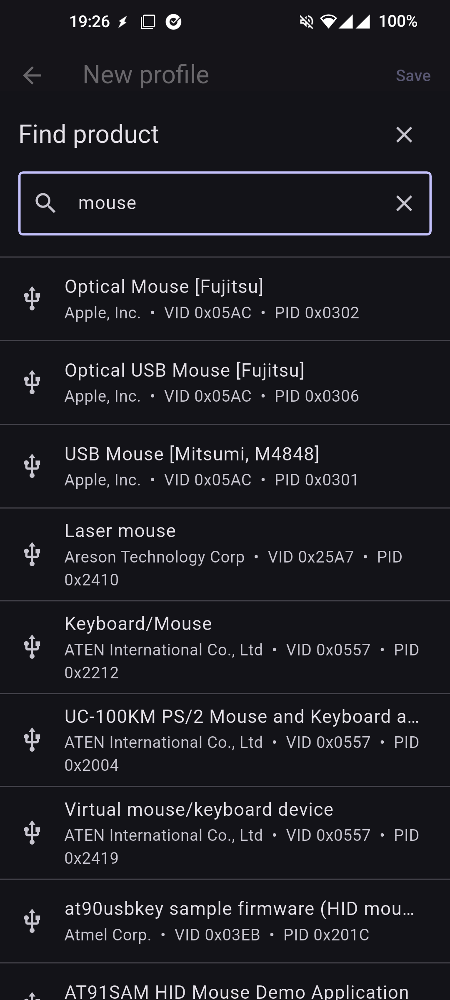
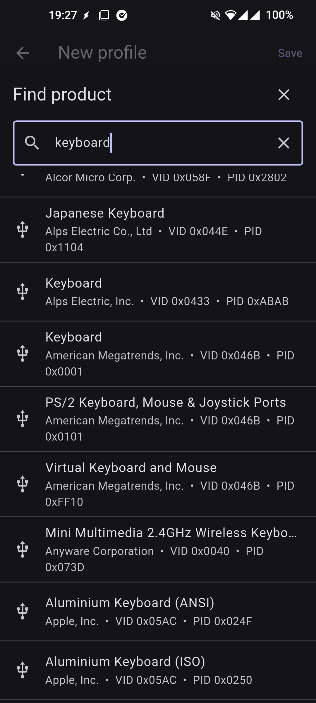
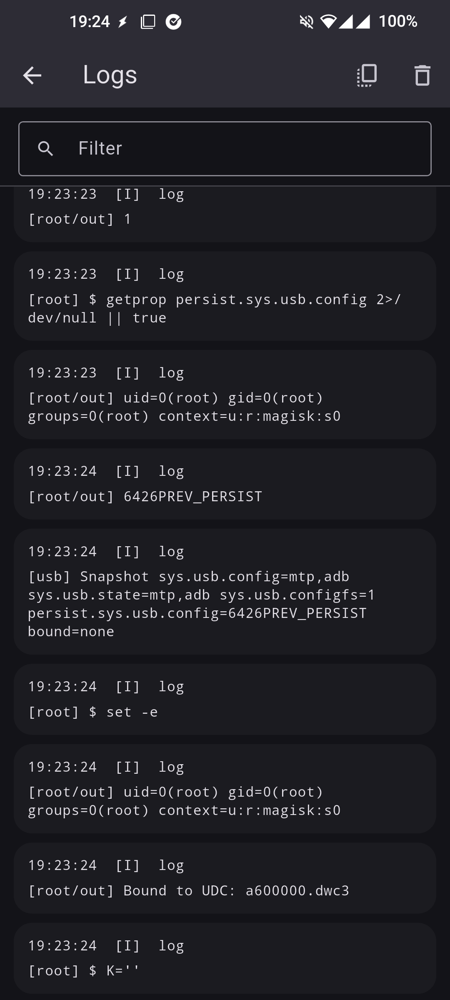

# HIDWiggle - Android USB HID Mouse Jiggler

<a href="https://github.com/iodn/hid-wiggle/releases">

</a>
<div>
<h3 style="font-size: 2.2rem; letter-spacing: 1px;">HIDWiggle - Android USB HID Mouse Jiggler</h3>
<p style="font-size: 1.15rem; font-weight: 500;"><strong>Open-source USB HID mouse jiggler for rooted Android devices with Linux ConfigFS support</strong><br><strong>HIDWiggle</strong> turns a supported Android device into a real USB mouse gadget and sends subtle pointer movement to keep a connected host awake. It includes configurable motion patterns, scheduling windows, USB identity settings, live diagnostics, and logs for controlled, local-first use.</p>

<div align="center">

  [](LICENSE)
  [](https://github.com/iodn/hid-wiggle/issues)
  [](https://github.com/iodn/hid-wiggle/pulls)
  [](https://www.android.com)
  [](#requirements)

  <div style="display:flex; align-items:center; gap:12px; flex-wrap:wrap; justify-content:center;">
    <a href="https://github.com/iodn/hid-wiggle/releases" style="display:inline-flex; align-items:center;">
      
    </a>
  </div>
</div>

## Overview

- Real USB HID mouse emulation:
  - Uses Linux USB Gadget and ConfigFS to expose the Android device as a mouse to the connected host.
- Human-like movement engine:
  - Micro wiggle, random drift, square, figure-eight, and pulse patterns with configurable interval, amplitude, jitter, randomness, and human-like variation.
- Practical scheduling:
  - Time windows, auto-stop, and pause rules for screen-off, charging, and low-battery states.
- USB identity controls:
  - Configure VID/PID, manufacturer, product, serial number, and max power; includes a USB ID lookup database.
- Diagnostics and logs:
  - Root, UDC, ConfigFS, active gadget state, HID writer readiness, and native log streams for troubleshooting.

Note: HIDWiggle requires root and a physical Android device whose kernel supports USB gadget mode through ConfigFS. Emulators cannot validate USB HID behavior.

## Features

- Mouse Jiggler Dashboard
  - Start and stop HID mouse movement from a focused control surface.
  - See active state, root status, USB gadget readiness, and movement status at a glance.
  - Keeps operation local: no accounts, no tracking, no ads.

- Movement Modes
  - Built-in patterns: micro, random drift, square, figure-eight, and pulse.
  - Tune interval, amplitude, randomness, jitter, and human-like behavior.
  - Preview movement behavior before running it against a host.

- Scheduler
  - Define allowed time windows by day and time.
  - Optional auto-stop duration.
  - Pause rules for screen off, charging, and low battery.

- USB Gadget Identity
  - Configure VID/PID and USB string descriptors.
  - Set manufacturer, product, serial number, and max power.
  - Search embedded `usb.ids` data to inspect vendor/product identifiers.

- Test Mode
  - Enable the mouse gadget without automatic movement.
  - Send manual left/right/up/down movement, button clicks, and scroll reports.
  - Useful for validating host enumeration and HID report delivery.

- Diagnostics & Logs
  - Inspect root availability, ConfigFS paths, UDC status, bound gadgets, and HID device nodes.
  - Stream native backend logs from the Kotlin service layer.
  - Copy diagnostics for issue reports or device compatibility notes.


## Requirements

- Rooted Android device with a working `su` implementation.
- Linux USB Gadget and ConfigFS support in the device kernel.
- A UDC exposed under `/sys/class/udc`.
- ConfigFS mounted under `/sys/kernel/config/usb_gadget` or `/config/usb_gadget`.
- HID gadget support that can create device nodes such as `/dev/hidg*`.
- A physical USB data connection to the host. Charge-only cables will not work.

## Installation

1. Download the latest APK from Releases:

  <a href="https://github.com/iodn/hid-wiggle/releases" style="display:inline-flex;">
    
  </a>

2. Install the application:
   - Enable installation from unknown sources if needed.
   - Grant root when prompted by your root manager.

3. Launch and configure:
   - Open HIDWiggle.
   - Confirm root and USB gadget readiness on the dashboard.
   - Review USB identity settings if the host requires specific descriptors.
   - Use Test Mode first to validate that the host sees the Android device as a mouse.

## Usage

### Running the Mouse Jiggler

1. Connect the Android device to the target host with a data-capable USB cable.
2. Open HIDWiggle and verify that root and USB gadget support are available.
3. Pick a movement mode and adjust interval/amplitude as needed.
4. Start movement from the dashboard.
5. Stop movement from the app when finished, or use Panic Stop if the gadget needs a quick unbind.

### Scheduling Movement

1. Open Scheduler.
2. Add or edit allowed time windows.
3. Configure auto-stop and pause rules.
4. Save the schedule and start the jiggler when the device is connected to the host.

### Testing HID Reports

1. Open Test Mode.
2. Enable the mouse gadget.
3. Send directional movement, click, and scroll reports.
4. Check Logs and Diagnostics if the host does not respond.

## Screenshots

  
  
  
  
  
  
  
  
  

## Build and Run

Prerequisites:

- Flutter stable toolchain
- Android SDK configured for Flutter
- A rooted physical Android device for runtime validation

Steps:

```bash
flutter pub get
flutter run
```

Release builds:

- Configure a proper release signing setup before publishing.
- The current Gradle release build uses debug signing for local convenience.

## Troubleshooting

- Root check fails:
  - Verify Magisk/SU policy and grant root to HIDWiggle.
- No UDC found:
  - Confirm `/sys/class/udc` contains a controller and the device supports USB device mode.
- Host does not see a mouse:
  - Use a data cable, try another USB port, and validate descriptors in USB identity settings.
- `/dev/hidg*` is missing:
  - The kernel or ROM may not include the HID gadget function.
- Gadget remains bound after a failure:
  - Use Panic Stop, then reconnect USB if needed.

## Security Notes

- HIDWiggle changes how the Android device presents itself over USB while active.
- Root access and ConfigFS writes can affect ADB, charging behavior, and other USB gadget functions.
- Use it only on systems you own or are authorized to test.

## Contributing

Contributions are welcome. If you add movement patterns, scheduling behavior, or backend gadget changes, please include matching UI validation, diagnostics, and focused tests where practical.

## License

This project is licensed under the GNU GPLv3 License. See [LICENSE](LICENSE).

## Support

If you encounter issues or have device compatibility notes, open an issue on the GitHub repository.

## More Apps by KaijinLab

| App                                                               | What it does                                                                 |
| ----------------------------------------------------------------- | ---------------------------------------------------------------------------- |
| **[IR Blaster](https://github.com/iodn/android-ir-blaster)**      | Control and test infrared functionality for compatible devices.              |
| **[USBDevInfo](https://github.com/iodn/android-usb-device-info)** | Inspect USB device details and behavior to understand what's connected.      |
| **[GadgetFS](https://github.com/iodn/gadgetfs)**                  | Manage rooted Android USB gadget roles with ConfigFS.                        |
| **[TapDucky](https://github.com/iodn/tap-ducky)**                 | Run controlled DuckyScript HID workflows on supported rooted devices.        |
| **[HIDWiggle](https://github.com/iodn/hid-wiggle)**               | Keep a connected host awake with Android-powered USB HID mouse movement.     |
| **[AKTune](https://github.com/iodn/android-kernel-tweaker)**      | Adaptive Android kernel auto-tuner for CPU/GPU/scheduler/memory/I/O.         |
